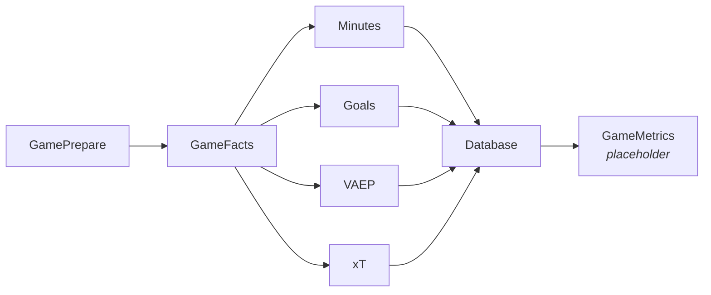

# insights

Computes and persists player-level performance metrics for football matches. The core analytics engine of the packing-report pipeline.

## Pipeline

For each unprocessed game, the following runs in sequence:



| Step | Class | Description |
|---|---|---|
| **Prepare** | `GamePrepare` | Syncs player/team/squad metadata to DB before computation |
| **Minutes** | `Minutes` | Calculates minutes played for each player (accounting for subs and red cards) |
| **Goals** | `Goals` | Tracks goals for/against while each player was on the pitch |
| **VAEP** | `Vaep` | Rates actions by their impact on scoring/conceding probability |
| **xT** | `Xt` | Rates actions by expected threat contribution |
| **High-level** | `GameMetrics` (stub) | Placeholder for future composite metrics |

## Structure

```
insights/
├── gi.py                   # Main orchestration script
├── game/
│   ├── game_prepare.py     # GamePrepare — metadata sync
│   ├── game_facts.py       # GameFacts — metric computation orchestrator
│   └── game_metrics.py     # GameMetrics — stub for high-level metrics
├── metrics/
│   ├── low_level/
│   │   ├── minutes.py      # Minutes played
│   │   ├── goals.py        # Net goals on pitch
│   │   ├── vaep.py         # VAEP model inference
│   │   └── xt.py           # xT model inference
│   └── high_level/
│       ├── metric.py       # Abstract base class
│       ├── elo.py          # PlayerELO prototype
│       ├── pm.py           # Plus-minus prototype
│       └── mov_elo/
│           └── regressor.py # Margin-of-victory regressor (NGBoost)
└── pyproject.toml
```

## Dependencies

- `socceraction[xgboost]` — SPADL conversion, VAEP, xT
- `soccerdata` — WhoScored data access
- `database-io` (workspace) — repository layer
- `joblib`, `numpy`, `pandas`
