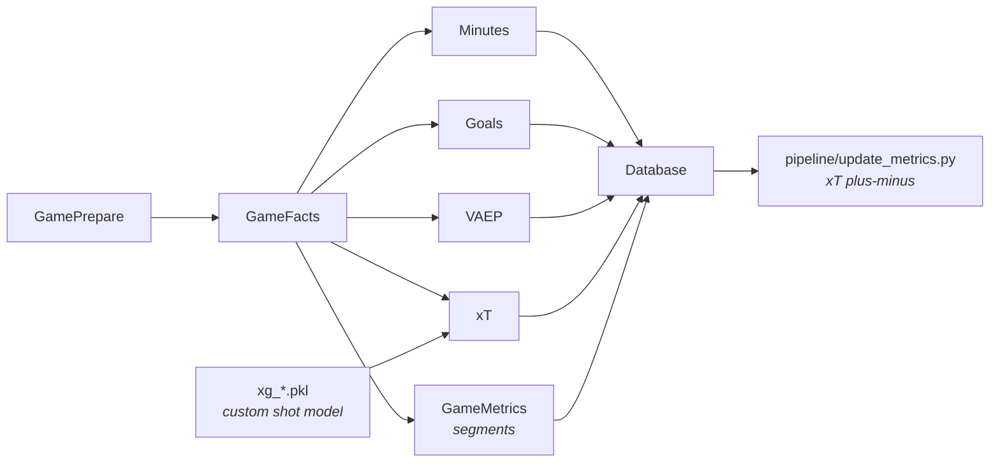
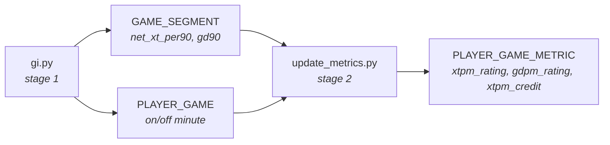

# insights

Computes and persists player-level performance metrics for football matches. The core analytics engine of the packing-report pipeline.

## Pipeline

For each unprocessed game, the following runs in sequence:


```mermaid
graph LR
    A[GamePrepare] --> B[GameFacts]
    B --> C1[Minutes]
    B --> C2[Goals]
    B --> C3[VAEP]
    B --> C4[xT]
    M["xg_*.pkl<br/><i>custom shot model</i>"] --> C4
    C1 --> D[Database]
    C2 --> D
    C3 --> D
    C4 --> D
    B --> E[GameMetrics<br/><i>segments</i>]
    E --> D
    D --> F[pipeline/update_metrics.py<br/><i>xT plus-minus</i>]
```

| Step | Class | Description |
|---|---|---|
| **Prepare** | `GamePrepare` | Syncs player/team/squad metadata to DB before computation |
| **Minutes** | `Minutes` | Calculates minutes played for each player (accounting for subs and red cards) |
| **Goals** | `Goals` | Tracks goals for/against while each player was on the pitch |
| **VAEP** | `Vaep` | Rates actions by their impact on scoring/conceding probability |
| **xT** | `Xt` | Rates actions by expected threat contribution |
| **Segments** | `GameMetrics` | Turns the game into durable segment facts for the plus-minus regression |

## xT plus-minus

The plus-minus rating is a regression of a team-level dependent variable on signed player
indicators, run per game so that every player ends up with a rating *history* rather than a single
end-of-season number.


```mermaid
graph LR
    A["gi.py<br/><i>stage 1</i>"] --> B["PLAYER_GAME<br/><i>on/off minute</i>"]
    A --> C["GAME_SEGMENT<br/><i>net_xt_per90, gd90</i>"]
    C --> D["update_metrics.py<br/><i>stage 2</i>"]
    B --> D
    D --> E["PLAYER_GAME_METRIC<br/><i>xtpm_rating, gdpm_rating, xtpm_credit</i>"]
```

### Stage 1 — segments (`game_metrics.py`, `game_segments.py`)

`GameMetrics` runs after the low-level metrics because it reuses the presence intervals built by
`Minutes` and the single xT pricing pass built by `Xt`. It writes the game header, one
`PLAYER_GAME` row per player carrying `on_minute` / `off_minute`, and one `GAME_SEGMENT` row per
segment. Everything is upserted, so re-running a game overwrites it in place.

A segment ends at a substitution or a sending-off; because the match itself ends at the first
sending-off (`Minutes.end_of_game`), every retained segment is 11-v-11 and no red-card dummy players
are required. Both dependent variables are normalised per 90 minutes, and the default segment weight
is `duration / 90`.

### Stage 2 — the regression (`metrics/high_level/xtpm/`)

Stage 2 reads the segments and the presence intervals back from the database and rebuilds who was on
the pitch in each segment. It needs neither the raw events nor the xT model, so a full rescore runs
in seconds. Games are absorbed in chronological order into a persistent state that discounts its
accumulated statistics once per game (`forgetting`) and solves a ridge penalty (`ridge`).

The state is maintained as blocks of players who have appeared together, and each block is solved
independently, so a full re-solve is not quadratic in the player count. Both dependent variables —
xT and goal difference — share one design matrix, which is what makes the goal-difference arm a
like-for-like baseline rather than a separate model.

Because `ridge` and `forgetting` are deliberately kept *outside* the persisted state, they can be
changed and every processed match rescored without replaying an event:

```bash
uv run pipeline/update_metrics.py --rebuild
```

## Custom xG for shots

The built-in xT surface prices every shot as *the same* value — the goal probability of the cell it
was taken from — regardless of how good the chance actually looked. A one-touch shot from the
six-yard box and a scuffed effort from thirty yards cost the same. `metrics/low_level/xg.py` replaces
that with a learned per-shot probability.

### How it plugs in

`Xt.rate_shots` is the seam. When an `xg_*.pkl` artifact is present in `models/model/`, shots are
priced with it; when none is found, xT falls back to the cell surface and says so in the log. The shot
is still valued as *goal probability minus the xT already earned by arriving in that cell*, so the
value of the move into the cell is never paid twice.

The artifact holds the fitted booster **and its feature name list**, so a model trained against a
different feature layout is rejected at load time rather than silently scoring against shifted
columns.

Because this changes the persisted low-level `xt` metric, games scored under move-only behaviour need
`uv run insights/gi.py --force` to be re-derived.

### Features

42 features in two sets, so the trainer can prove the second block earns its place:

| Set | Features |
|---|---|
| `base` (9) | `start_x`/`start_y`, distance to goal centre and to each post, angle to goal, lateral offset from centre, body part, free-kick flag |
| `full` (42) | `base` + assist type one-hots (25 categories), assist travel distance, assist success, `time_since_assist`, actions since the team last lost the ball, nearby defenders and teammates, minutes on pitch, substitute flag |

Two choices are worth calling out:

- **`time_since_assist`** is the closest thing to knowing the ball's height when the shot was struck.
  In SPADL a shot's `start` *is* the previous action's `end`, so the gap between the two rows says
  whether the ball was still in flight. A shot taken within a second of the assist converted **0.7%**
  of the time; at three seconds, **17.8%**. Timestamps are only whole seconds, but that is enough to
  separate a first-time shot from a set-up one — and it is worth more than every other lookback
  feature combined. See the `xg.py` docstring for the artefact checks that rule out a blocked-shot
  timestamp explanation.
- **The assist vocabulary is fixed in code**, spanning every SPADL action type even though most never
  precede a shot. Choosing categories by which correlate with goals in the training sample would
  bake this season's patterns into the feature set.

Penalties are excluded from training and scored with a smoothed rate from the season instead
(`70/84 → 0.825`), so they never reach the tree.

### Training

```bash
uv run models/train/train_xg.py
```

Evaluation is grouped by `game_id`, so no shot is ever scored by a model that saw a different match.
The trainer fits both feature sets over a small hyper-parameter grid, reports the nested ablation,
benchmarks against the xT surface as a baseline, and writes both a `.pkl` and a `.json` of metrics
and calibration. Retraining is a couple of minutes for a full season.

### Results — 2021/22 Bundesliga, 306 games

7,847 non-penalty shots, 854 goals. Out-of-fold:

| Model | Log loss | Brier | AUC |
|---|---|---|---|
| League constant | 0.3441 | 0.0970 | 0.5000 |
| xT surface | 0.3136 | 0.0894 | 0.7338 |
| This model, `base` | 0.3057 | 0.0880 | 0.7393 |
| **This model, `full`** | **0.2686** | **0.0786** | **0.8255** |

The geometry alone (`base`) barely improves on the xT surface — the shot's distance and angle are
already what the surface encodes. The lookback block is what separates them: +0.037 log loss and
+0.086 AUC, for a total of 0.045 log loss and 0.09 AUC over the surface. In other words the model
learns almost nothing about *where* the shot came from that the surface did not already say, and a
great deal about *how* it was set up.

### Known limitation

`goalMouthY` / `goalMouthZ` — **the strongest single predictor of a goal** — are present on 100% of
shots in the raw feed and deliberately *not* used, because SPADL drops them and the rest of the
pipeline works in SPADL. Between them they separate 26% conversion (aimed low) from 0% (over the bar).
Restoring them means extending the conversion, not the model.

## Structure

```
insights/
├── gi.py                   # Main orchestration script (stage 1 entry point)
├── game/
│   ├── game_prepare.py     # GamePrepare — metadata sync
│   ├── game_facts.py       # GameFacts — metric computation orchestrator
│   ├── game_metrics.py     # GameMetrics — segments + player presence intervals (stage 1)
│   └── game_segments.py    # Segment construction and per-segment goals
├── metrics/
│   ├── low_level/
│   │   ├── minutes.py      # Minutes played
│   │   ├── goals.py        # Net goals on pitch
│   │   ├── vaep.py         # VAEP model inference
│   │   ├── xt.py           # xT model inference, incl. the custom-xG shot seam
│   │   └── xg.py           # Custom per-shot xG: features, artifact contract, XgRegressor
│   └── high_level/
│       ├── metric.py       # Abstract base class
│       ├── elo.py          # PlayerELO prototype
│       ├── mov_elo/
│       │   └── regressor.py # Margin-of-victory regressor (NGBoost)
│       └── xtpm/
│           ├── features.py # Design matrix, observations, literature notes
│           └── estimator.py # Discounted-ridge state and block-sparse solve
└── pyproject.toml
```

`high_level/plus-minus.py` and `plus-minus.md` are the discarded Elo-style prototype and the paper
review that motivated the design. The filename contains a hyphen, so the module is not importable;
`xtpm/` supersedes it.

## Dependencies

- `socceraction[xgboost]` — SPADL conversion, VAEP, xT
- `soccerdata` — WhoScored data access
- `database-io` (workspace) — repository layer
- `joblib`, `numpy`, `pandas`
