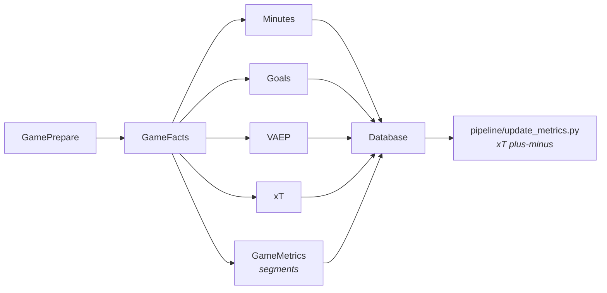
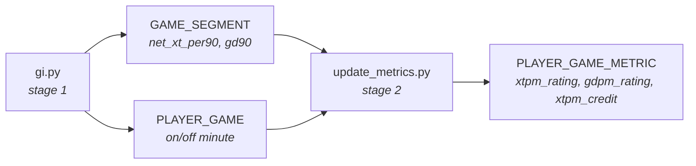

# insights

Computes and persists player-level performance metrics for football matches. The core analytics engine of the packing-report pipeline.

## Pipeline

For each unprocessed game, the following runs in sequence:


```mermaid
graph LR
    A[GamePrepare] --> B[GameFacts]
    B --> C1[Minutes]
    B --> C2[Goals]
    B --> C3[VAEP]
    B --> C4[xT]
    C1 --> D[Database]
    C2 --> D
    C3 --> D
    C4 --> D
    B --> E[GameMetrics<br/><i>segments</i>]
    E --> D
    D --> F[pipeline/update_metrics.py<br/><i>xT plus-minus</i>]
```

| Step | Class | Description |
|---|---|---|
| **Prepare** | `GamePrepare` | Syncs player/team/squad metadata to DB before computation |
| **Minutes** | `Minutes` | Calculates minutes played for each player (accounting for subs and red cards) |
| **Goals** | `Goals` | Tracks goals for/against while each player was on the pitch |
| **VAEP** | `Vaep` | Rates actions by their impact on scoring/conceding probability |
| **xT** | `Xt` | Rates actions by expected threat contribution |
| **Segments** | `GameMetrics` | Turns the game into durable segment facts for the plus-minus regression |

## xT plus-minus

The plus-minus rating is a regression of a team-level dependent variable on signed player
indicators, run per game so that every player ends up with a rating *history* rather than a single
end-of-season number.


```mermaid
graph LR
    A["gi.py<br/><i>stage 1</i>"] --> B["PLAYER_GAME<br/><i>on/off minute</i>"]
    A --> C["GAME_SEGMENT<br/><i>net_xt_per90, gd90</i>"]
    C --> D["update_metrics.py<br/><i>stage 2</i>"]
    B --> D
    D --> E["PLAYER_GAME_METRIC<br/><i>xtpm_rating, gdpm_rating, xtpm_credit</i>"]
```

### Stage 1 — segments (`game_metrics.py`, `game_segments.py`)

`GameMetrics` runs after the low-level metrics because it reuses the presence intervals built by
`Minutes` and the single xT pricing pass built by `Xt`. It writes the game header, one
`PLAYER_GAME` row per player carrying `on_minute` / `off_minute`, and one `GAME_SEGMENT` row per
segment. Everything is upserted, so re-running a game overwrites it in place.

A segment ends at a substitution or a sending-off; because the match itself ends at the first
sending-off (`Minutes.end_of_game`), every retained segment is 11-v-11 and no red-card dummy players
are required. Both dependent variables are normalised per 90 minutes, and the default segment weight
is `duration / 90`.

### Stage 2 — the regression (`metrics/high_level/xtpm/`)

Stage 2 reads the segments and the presence intervals back from the database and rebuilds who was on
the pitch in each segment. It needs neither the raw events nor the xT model, so a full rescore runs
in seconds. Games are absorbed in chronological order into a persistent state that discounts its
accumulated statistics once per game (`forgetting`) and solves a ridge penalty (`ridge`).

The state is maintained as blocks of players who have appeared together, and each block is solved
independently, so a full re-solve is not quadratic in the player count. Both dependent variables —
xT and goal difference — share one design matrix, which is what makes the goal-difference arm a
like-for-like baseline rather than a separate model.

Because `ridge` and `forgetting` are deliberately kept *outside* the persisted state, they can be
changed and every processed match rescored without replaying an event:

```bash
uv run pipeline/update_metrics.py --rebuild
```

### Custom xG for shots

`Xt.rate_shots` is the seam where a custom xG model plugs in. Without one, a shot is priced as its
goal probability minus the xT already earned by arriving in that cell, so the value of the move
into the cell is never paid twice. When an `xg_*.pkl` model is available it is used for the shots
instead; this changes the persisted low-level `xt` metric, so games processed under the older
move-only behaviour need `uv run insights/gi.py --force`.

## Structure

```
insights/
├── gi.py                   # Main orchestration script (stage 1 entry point)
├── game/
│   ├── game_prepare.py     # GamePrepare — metadata sync
│   ├── game_facts.py       # GameFacts — metric computation orchestrator
│   ├── game_metrics.py     # GameMetrics — segments + player presence intervals (stage 1)
│   └── game_segments.py    # Segment construction and per-segment goals
├── metrics/
│   ├── low_level/
│   │   ├── minutes.py      # Minutes played
│   │   ├── goals.py        # Net goals on pitch
│   │   ├── vaep.py         # VAEP model inference
│   │   └── xt.py           # xT model inference, incl. the custom-xG shot seam
│   └── high_level/
│       ├── metric.py       # Abstract base class
│       ├── elo.py          # PlayerELO prototype
│       ├── mov_elo/
│       │   └── regressor.py # Margin-of-victory regressor (NGBoost)
│       └── xtpm/
│           ├── features.py # Design matrix, observations, literature notes
│           └── estimator.py # Discounted-ridge state and block-sparse solve
└── pyproject.toml
```

`high_level/plus-minus.py` and `plus-minus.md` are the discarded Elo-style prototype and the paper
review that motivated the design. The filename contains a hyphen, so the module is not importable;
`xtpm/` supersedes it.

## Dependencies

- `socceraction[xgboost]` — SPADL conversion, VAEP, xT
- `soccerdata` — WhoScored data access
- `database-io` (workspace) — repository layer
- `joblib`, `numpy`, `pandas`
